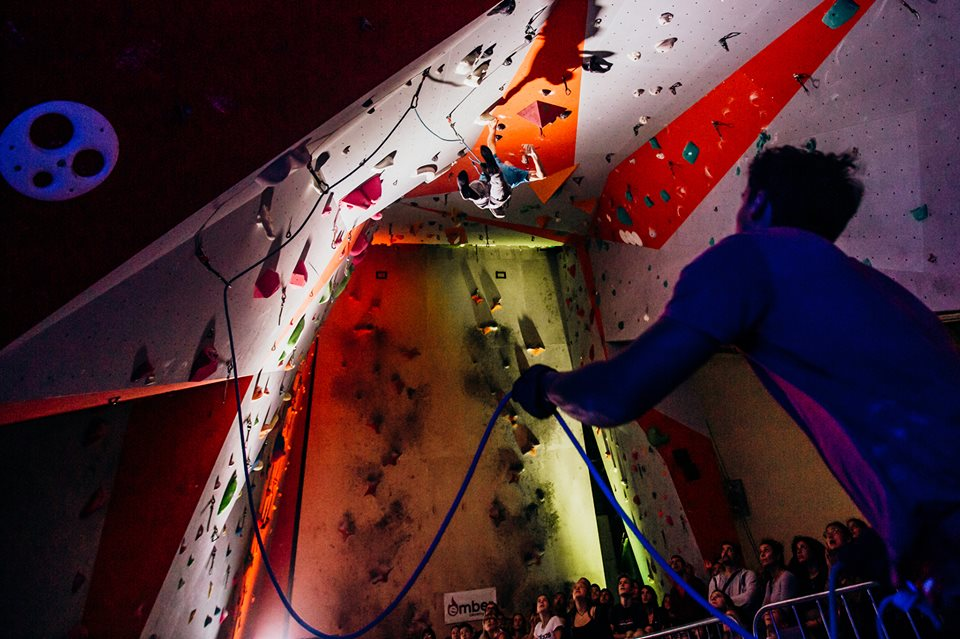

<!-- markdownlint-disable MD033 -->

<figure class="figure">
    
    <figcaption class="figure__caption">Title</figcaption>
</figure>

## Report - PH lead 2018.!

Lead se vratia na PH!

PC i naš klub su prošlog vikenda po drugi put ugostili Prvenstvo Hrvatske u leadu! Natjecanju se odazva kvalitetan broj natjecatelja, a  ponudilo je pregršt uzbudljivog penjanja tijekom oba dana.

SUBOTA je bila rezervirana za mlađe uzrasne kategorije koje su nas i ove godine oduševile energijom i potencijalom.  Naši postavljači su posebno truda uložili u postavljanje i testiranje težine smjerova kako bi tako kvalitetni mladi penjači dobili linije u kojima će moći pokazati koliko doista mogu i koji će ih motivirati za daljnji trening. Virujemo da smo u tome većinom  i uspili. Ovom prilikom čestitke svim natjecateljima koji su nastupili bez obzira na plasman, a posebno novim prvacima HR koje ćemo nabrojati kroz kategorije:

MLAĐI CICIBANI:

Lara Uljević (Marulianus) / Niko Uhač (OnSight)

CICIBANI:

Ljubica Kuvačić (Mosor) / Darian Duka (Marulianus)

MLAĐI KADETI:

Lena Opačić (Fothia) / Lovre Čulić (Mosor)

KADETI:

Eni Malenica (Marulianus) / Jan Mišić (Fothia)

STARIJI KADETI:

Lara Kmoch (Fothia) / Filip Kurtović (OnSight)

JUNIORI:

Vana Piccini (Marulianus) / Mikula Bašić (Marulianus)

STARIJI JUNIORI:

Kasija Rnjak (Mosor)

Definitivno je da se u HR radi sa mladim penjačima i da nam ne manjka kvalitete ali nas zabrinjava rasipanje broja djece u starijim kategorijama koje traje već duži niz godina. Nadamo se da će se taj trend zaustaviti.
