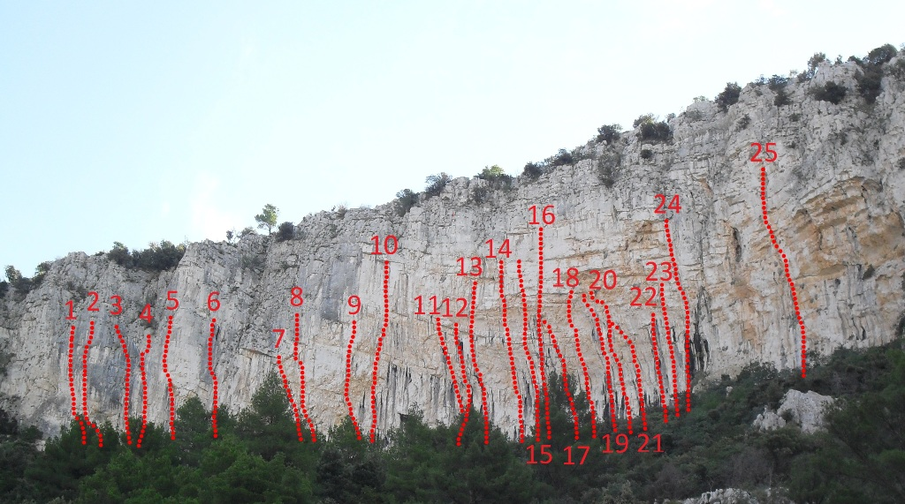

<!-- markdownlint-disable MD033 -->

<figure class="figure">
    
</figure>

#SMJEROVI

| Nmb | Ime                                             | Ocjena | Duzina | Add
|:----:|:------------------------------------------------:|:------:|:-------:|:-------:|
| 01. | ALEX ASCENTS FROM A HELL FOR A BOTTLE OF MILK | 6c | 18 m |
 + 
 |
| 02. | FESTINA LENTE | 7b/b+ | 18 m |
 + 
 |
| 03. | EKSPEDICIJSKI KAMIN | 5a | 18 m |
 + 
 |
| 04. | CARSKO VINO | 7a | 18 m |
 + 
 |
| 05. | GRACIJA | 6c | 18 m |
 + 
 |
| 06. | STONE ROSES | 7a | 16 m |
 + 
 |
| 07. | VENERA | 6c | 16 m |
 + 
 |
| 08. | GLORIJA | 7a | 16 m |
 + 
 |
| 09. | BOLERO | 6c | 16 m |
 + 
 |
| 10. | FUSION | 7c | 15 m |
 + 
 |
| 11. | BLACK BOY | 6c+ | 15 m |
 + 
 |
| 12. | U2 | 7b | 15 m |
 + 
 |
| 13. | MARINERO | 6b+ | 15 m |
 + 
 |
| 14. | MARJAN 86 | 6c | 18 m |
 + 
 |
| 15. | ADAGGIO | 6a | 9 m |
 + 
 |
| 16. | SVETI DUJE | 8a | 20 m |
 + 
 |
| 17. | NOVI ULAZ U MARULIANUS | 6a | 9 m |
 + 
 |
| 18. | MARULIANUS | 7c/c+ | 20 m |
 + 
 |
| 19. | MILLENIUM | 8a | 20 m |
 + 
 |
| 20. | PROJEKT | ? | 5 m |
 + 
 |
| 21. | ANYA | 6a+ | 20 m |
 + 
 |
| 22. | BALADA ZA ADELU | 7c | 20 m |
 + 
 |
| 23. | DANSKA VARIJANTA | 6c+ | 20 m |
 + 
 |
| 24. | LOCAL HERO | 6c | 18 m |
 + 
 |
| 25. | DUPINOV | 6a | 20 m |
 + 
 |
| 26. | LIVO OD ČEMPRESA | 6a | 11 m |
 + 
 |
| 27. | DESNO OD ČEMPRESA | 5c | 11 m |
 + 
 |
| 28. | I LIKE COMMUNIST PARTY | 6a | 10 m |
 + 
 |
| 29. | A.O.M. | 5a | 10 m |
 + 
 |

#GDJE?

<iframe src="https://www.google.com/maps/embed?pb=!1m18!1m12!1m3!1d11563.97771969615!2d16.5073563381684!3d43.5649991659888!2m3!1f0!2f0!3f0!3m2!1i1024!2i768!4f13.1!3m3!1m2!1s0x13355f4be5ef0a2d%3A0x7c203a8fd147967f!2sMarkezina+Greda!5e0!3m2!1shr!2shr!4v1546011854810"  class="karta" frameborder="0" style="border:0" allowfullscreen></iframe>

#O Penjalištu

  <input type="checkbox" class="read-more-state" id="post-1" />

  
Marjan je dar od Boga splitskim penjačima! Zaista se rijetki mogu pohvalit da imaju ovakvo penjalište usrid grada!. Brdo Marjan u cjelini kao i samo penjalište, povijesno su bogati. Prapovijesni nalazi pronađeni su na brežuljku Bambina glavica, a na rtu poluotoka vidljivi su temelji antičkog hrama Dijane, rimske božice lova.
Na Šantinim stinama, na pročelju Karepićeve litice, davne 1523.g. uklesana je poruka starih neimara upućena svima kojima su na srcu Marjan, Split i domovina: CONCORDES VOTA SEQUNTURDISCORDES FRUSTRA LABORANT -  "Složni slijede ono što je dobro, a nesložni uzalud rade!"
U stijeni se izdaleka vide antičke građevine gdje su svoj život provodili pustinjaci - eremiti. Jedna takva građevina se nalazi blizu crkvice svetog Jerolima u procijepu stine, a u neposrednoj blizini eremitaže u sličnom okomitom procijepu nalazi se kula, koja je služila za obranu seljaka s obližnjih polja u slučaju napada Turaka.
Ime brda Marjan rimskog je porijekla. Ako uzmemo da je oporuka splitskog priora Petra načinjena u prvoj polovici 8. stoljeća, onda je u to doba prvi put zabilježeno ime brda Marjan kao Marulianus.

  
  <label for="post-1" class="read-more-trigger"></label>

