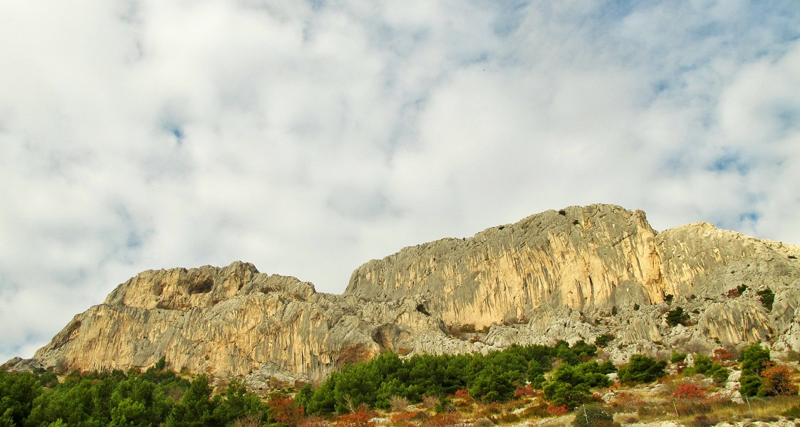

<!-- markdownlint-disable MD033 -->

<figure class="figure">
    
    <figcaption class="figure__caption">Title</figcaption>
</figure>

## Jesenji momenti!

Nastavlja se neobično topla jesen u domovini težaka, fatalnoj Dalmaciji!
...
Na Vrulji se situacija smirila, nakon što su krajem tjedna Kruder & Co. napustili područje. Ipak, nemirno je Jernej spava u rodnom Celju, pa je spakira kufere i ponovo se vratija. Borba sa projektom se nastavlja, a situacija je neizvjesna ka i do sada. Pitali smo za kratki komentar lokalnog PR stručnjaka i menađera Ivana Kuvačića Moca: "Marule, Kruder je u odličnoj formi ali slabo nas služi vrime, a odvalilo mu se i hvatište di je do sada odmara u smjeru, pa je možda sve skupa i nešto teže nego do sada!". Je, forma kod nas nikad nije dovoljna - svejedno šaljemo podršku i dobru energiju Jerneju. U nas se uvik cijenilo kad neko gine, a on to radi u velikom stilu!

Nekidan prekrasan etički moment u vertikalama Gospinice. Luka Trumbić Trumba prolazi Biceps o muerte (7c) ali osiguravatelj, legendarni Branko Kragić daje par centimetera kraću žlingu kad su noge izletile iz prevjesa. Trumba ka pravi izbornik i uzor dici (ali i roditeljima) odlučuje ne upisat smjer u svoj 7c+.nu karton i javlja u redakciju: "Ukopčava sam sidro, a nisam ima osjećaj da sam proša, zna sam da to nije to!". Etika i dalje nije mrtva, Luka velik si!

Koristimo priliku i za poslat pozdrav Frenku, Sabini i Maticu koji su se nakon par nezaboravnih dana morali vratit u Sloveniju ali i Marulovoj školi koja ovog vikenda ima prvi izlet vanka - navodno, ide se busom na kat sa Sukoišanske!
