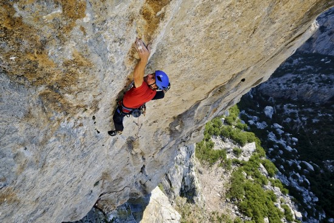

<!-- markdownlint-disable MD033 -->

<figure class="figure">
    
</figure>

## Ponovljen Spomin!

Adam Ondra je danas u Paklenici izvea prvo ponavljanje smjera Spomin (8c, 350m) i to on sight!
Radi se o usponu sa druge galaksije na kojeg uopće nemamo komentara...

Vridi spomenit da je smjer autorsko djelo legendarne naveze Silvo Karo - Janez Jeglič iz 1984. uz sudjelovanje Frančeka Kneza pri uređenju direktne varijante izlaza godinu posli (1985.). Tada najteži tehnički smjer u kuku s vremenom postaje zadnji veliki projekt za slobodan uspon kojeg napokon 2017. prvi oslobađa Luka Krajnc nakon više sezona rada na liniji.
Sinoć uoči današnjeg uspona, Ondra nam je posla poruku da je proučava smjer cili dan i da čisto sumnja u on sight uspon bez ukapčanja u smjeru i magnezija. Čini se da je danas iznenadia i samog sebe :-)

Za kraj bi tili čestitat Marku Marasoviću koji je četvrtak postavlja po smjeru statike za tv ekipu, a danas odradia vrhunski posal za gri grijem. Marko, ako se nakon današnjih šokova odlučiš ostavit penjanja, znaj da te razumimo!

...

Nastavlja se luda jesen u Dalmaciji...
