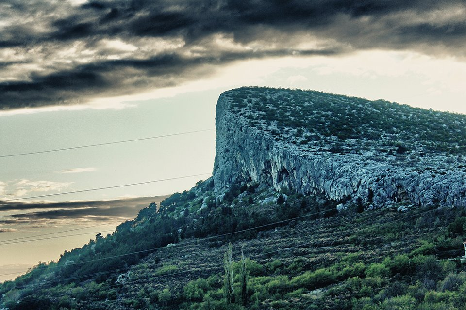

<!-- markdownlint-disable MD033 -->

<figure class="figure">
    
</figure>

## Odletia Njemac!

Pažnja na Gredi!
Nekidan na Markezinoj gredi, mladom penjaču iz Njemačke prilikom pada u prvoj dužini Goginog puca gornji karabiner ukapčanja na petom spitu i falia je samo metar-dva da priča završi tragičnim ground fall-om!

Zanimljivo je da se radi o starom ukapčanju koje već sezonu-dvi visi u smjeru. Takvih ukapčanja ima i u nekim drugim klasicima na tom našem penjalištu di je tzv. kićenje smjerova skoro pa stvar prestiža.
Šalu na stranu. S obzirom da niko nemože zabranit kićenje ili mu stat na kraj pozivamo vas da pripazite pri korištenju takvih ukapčanja, a vlasnicima da ih slobodno bace u škovace ako znaju da su ukapčanja priživila par bura na Gredi ili nedaj Bože cilu zimu. Vremenski uvjeti na Gredi su extremni i to dodatno pospješuje propadanje opreme.

Penjanje je srića, nemojmo da se pritvori u nešto drugo...
